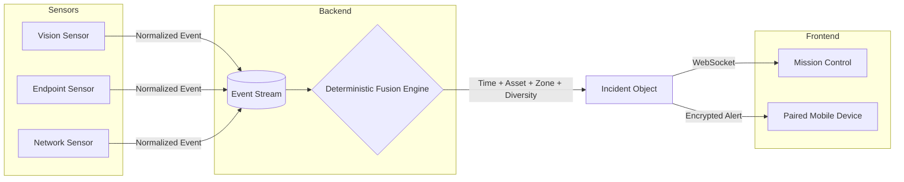

<div align="center">

# SENTRIX

**Security systems see events. SENTRIX sees relationships.**

[](https://www.python.org/downloads/)
[](https://vitejs.dev/)
[](https://fastapi.tiangolo.com/)
[]()
[](LICENSE)

*Built for **Argonyx '26** by **Team The Quarks**.*

---

</div>

---

## One-Line Value Prop

> SENTRIX correlates physical, endpoint, and network signals into explainable incidents in real time — no alert fatigue, no guesswork, no LLM hallucinations.

---

## Architecture



---

## Why SENTRIX

A camera detects restricted-zone presence.  
An endpoint detects a large file transfer.  
A network monitor observes unusual outbound activity.

**Individually:** they are isolated alerts.  
**Together:** they may describe one real incident.

SENTRIX evaluates whether they align across:

- **Time** — within a configurable correlation window (default 30s)
- **Asset/Device** — exact `asset_id` match or resolved zone agreement
- **Network/Zone Context** — direct `zone_id` or explicit asset→zone map
- **Source Diversity** — minimum 3 distinct sources (vision + endpoint + network) required by default
- **Confidence** — noisy-OR combination across corroborating signals

**Correlation is not timestamp matching.** Two events at the same time with different asset context do not create an incident. This is enforced by the fusion engine — see `backend/app/fusion.py`.

---

## Negative Correlation (A Key Differentiator)

```
Same timestamp
+ different asset/device context
= NO incident
```

SENTRIX can **deliberately keep events separate**. The fusion engine builds connected clusters of compatible events — if a signal never shares context with the group, it stays out. Mismatched-context events produce zero incidents, not false positives.

| Scenario | Sources | Context | Outcome |
|----------|---------|---------|---------|
| `positive_correlation` | vision + endpoint + network | same asset + zone | **Incident created** |
| `asset_mismatch` | endpoint on device-A, others on device-B | asset mismatch | No incident (2/3 diversity) |
| `zone_mismatch` | vision in zone-A, others in zone-B | zone mismatch | No incident |
| `time_mismatch` | same asset/zone, 3rd signal late | window expired | No incident |

All four scenarios are in `backend/scenarios/` and run via `POST /api/demo/replay/{name}?live=true`.

---

## Core Features (Verified)

| Feature | Status | Implementation |
|---------|--------|----------------|
| **Real-Time Mission Control** | ✅ | React + Vite + WebSocket live event stream, device topology, incidents, source health, correlation reasoning |
| **Deterministic Contextual Fusion** | ✅ | `backend/app/fusion.py` — pure arithmetic + set logic, zero LLM calls, fully auditable |
| **Multi-Source Ingestion** | ✅ | Vision / Endpoint / Network normalized to common schema via `POST /api/events` |
| **Real Device Pairing (QR)** | ✅ | Short-lived token → user confirm → server-minted device_id + credential → heartbeat → realtime status |
| **Realtime WebSocket Updates** | ✅ | `event.created`, `incident.created`, `incident.updated`, `sensor.health`, `device.connected`, `device.updated`, `device.disconnected`, `incident.alert`, `system.reset` |
| **Phone Alerts (Paired Device)** | ✅ | Role-gated WS (`role=paired_device`), credential-validated, minimal `incident.alert` envelope only |
| **File Transfer Activity** | ✅ | macOS endpoint sensor watches `~/Desktop/SENTRIX_DEMO_TRANSFER`, reports real byte counts + progress |
| **Active Interception** | ✅ | >50MB transfer → kills OpenMTP, deletes payload, emits `file_transfer_anomaly` |
| **Positive + Negative Correlation** | ✅ | 4 demo scenarios covering match/mismatch on asset, zone, time, diversity |
| **Device Status Lifecycle** | ✅ | Background monitor: `ONLINE` → `DEGRADED` → `OFFLINE` via missed heartbeats, realtime push |
| **Security Hardening** | ✅ | Rate limiting, CORS allow-list, body size limits, security headers, WS origin validation |

---

## Rules Decide. AI Explains.

> **LLMs explain incidents. They don't decide them.**

Incident creation is 100% deterministic (`backend/app/fusion.py`) — time window, asset/zone compatibility, source diversity thresholds. No model call ever influences whether an incident exists.

If/when an LLM is added for SITREP text or summaries, it only runs **downstream** of incidents the fusion engine already created. The architecture enforces this boundary: the frontend never decides match/mismatch; it only renders backend-supplied `outcome` and `criteria`.

---

## System Architecture

```
┌─────────────────────────────────────────────────────────────────────┐
│                        SENTRIX SYSTEM                                │
├─────────────────────────────────────────────────────────────────────┤
│                                                                      │
│  ┌─────────────┐  ┌─────────────┐  ┌─────────────┐                  │
│  │   Vision    │  │  Endpoint   │  │  Network    │                  │
│  │   Sensor    │  │   Sensor    │  │   Sensor    │                  │
│  │  (adapter)  │  │  (adapter)  │  │  (adapter)  │                  │
│  └──────┬──────┘  └──────┬──────┘  └──────┬──────┘                  │
│         │                │                │                          │
│         └────────────────┼────────────────┘                          │
│                          ▼                                           │
│              ┌─────────────────────┐                                 │
│              │  POST /api/events   │  (rate-limited, validated)      │
│              └──────────┬──────────┘                                 │
│                         │                                           │
│              ┌──────────▼──────────┐                                 │
│              │  Ingestion Pipeline │                                 │
│              │  • parse + validate  │                                 │
│              │  • deduplicate       │                                 │
│              │  • store event       │                                 │
│              │  • resolve zone      │                                 │
│              │  • fusion.evaluate() │                                 │
│              └──────────┬──────────┘                                 │
│                         │                                           │
│          ┌──────────────┼──────────────┐                            │
│          ▼              ▼              ▼                            │
│   ┌───────────┐  ┌─────────────┐  ┌───────────┐                     │
│   │  Events   │  │  Incidents  │  │  Devices  │  (in-memory Store) │
│   └───────────┘  └─────────────┘  └───────────┘                     │
│          │              │              │                              │
│          └──────────────┼──────────────┘                              │
│                         ▼                                             │
│              ┌─────────────────────┐                                 │
│              │  WebSocket Broadcast│                                 │
│              │  event.created      │                                 │
│              │  incident.created   │                                 │
│              │  incident.updated   │                                 │
│              │  sensor.health      │                                 │
│              │  device.*           │                                 │
│              │  incident.alert     │  (paired_device role only)      │
│              └──────────┬──────────┘                                 │
│                         │                                           │
│        ┌────────────────┼────────────────┐                          │
│        ▼                ▼                ▼                          │
│  ┌──────────┐    ┌──────────────┐  ┌───────────┐                   │
│  │ Mission  │    │  Paired      │  │ Sensors   │                   │
│  │ Control  │    │  Phone       │  │ (poll/    │                   │
│  │ (React)  │    │  (React)     │  │  push)    │                   │
│  └──────────┘    └──────────────┘  └───────────┘                   │
│                                                                      │
└─────────────────────────────────────────────────────────────────────┘
```

---

## Repository Structure

```
T20-The-Quarks/
├── backend/
│   └── app/
│       ├── main.py              # FastAPI entrypoint, all endpoints
│       ├── fusion.py            # Deterministic correlation engine
│       ├── store.py             # In-memory event/incident/device store
│       ├── models.py            # Pydantic schemas (Event, Incident, Device)
│       ├── config.py            # Fusion thresholds, asset→zone map
│       ├── ws.py                # WebSocket manager (mission_control + paired_device)
│       ├── security.py          # Rate limiting, CORS, body limits, headers
│       ├── validation.py        # Event schema validation
│       └── logging_conf.py      # Structured stage logging
├── frontend/
│   └── src/
│       ├── pages/
│       │   ├── MissionControl.tsx      # Operator dashboard
│       │   ├── PhonePaired.tsx         # Paired phone live view + siren
│       │   ├── PairDevice.tsx          # QR scan destination (/pair/:token)
│       │   └── IncidentDetail.tsx      # Deep-dive incident page
│       ├── components/
│       │   ├── DeviceTopology.tsx      # Network/device graph with status
│       │   ├── ActiveIncidentPanel.tsx # Incident list + detail
│       │   ├── CorrelationBasis.tsx    # Match/mismatch reasoning table
│       │   ├── EventStream.tsx         # Live event feed
│       │   ├── TransferDashboard.tsx   # File transfer progress
│       │   ├── PairingPanel.tsx        # QR generation in Mission Control
│       │   └── SourceHealthPanel.tsx   # Vision/endpoint/network health
│       ├── services/
│       │   └── missionControlApi.ts    # Typed adapter over REST + WS
│       ├── domain/
│       │   └── types.ts                # Frontend-only domain contracts
│       ├── hooks/
│       │   ├── useMissionControlData.ts
│       │   └── useDeviceConnection.ts  # Phone WS + heartbeat state machine
│       └── lib/
│           ├── siren.ts                # Web Audio siren (unlock on gesture)
│           └── pairedDeviceStorage.ts  # localStorage for device credentials
├── sensors/
│   ├── usb_device_detector.py          # ioreg-based macOS USB detection (plist parse)
│   ├── usb_sensor_daemon.py            # 3s poll → POST /api/devices/observe
│   ├── mac_endpoint_agent.py           # watchdog on ~/Desktop/SENTRIX_DEMO_TRANSFER
│   ├── vision_adapter.py               # Camera-based detection (fallback)
│   ├── network_adapter.py              # Network flow monitoring (fallback)
│   ├── endpoint_adapter.py             # Generic endpoint events
│   └── common/client.py                # BackendClient (httpx wrapper)
├── scripts/
│   ├── start.sh                        # Backend + frontend + sensors
│   ├── stop.sh                         # Clean shutdown
│   ├── health_check.py                 # Full system health ([OK]/[DEGRADED])
│   ├── demo.sh                         # Reset → positive → negative scenario
│   ├── reset.sh                        # Clear in-memory state
│   ├── test-backend-e2e.py             # Black-box HTTP+WS against live server
│   ├── test-pairing-e2e.py             # Pairing, heartbeat, WS auth, privacy, alerts
│   ├── trigger_delayed.py              # Endpoint demo with OpenMTP
│   └── run_endpoint_demo.py            # Alternative demo runner
├── tests/
│   ├── test_pipeline.py
│   ├── test_chaos.py
│   └── test_realtime.py
├── backend/tests/
│   ├── test_api.py
│   ├── test_fusion.py
│   └── test_security.py
├── docs/
│   ├── API_CONTRACT.md                 # Canonical API + WebSocket + fusion rules
│   └── MISSION_CONTROL_CONTRACT.md     # Frontend domain contract
├── render.yaml                         # Render.com deployment (backend)
├── requirements.txt                    # Python deps (backend + sensors)
├── package.json                        # Frontend deps (Vite, React, Tailwind)
└── README.md
```

---

## Event Model (Normalized)

```jsonc
{
  "eventId": "evt-vis-01",
  "timestamp": "2026-09-26T10:00:00.000Z",
  "source": "vision",
  "eventType": "person_in_restricted_zone",
  "deviceId": "PHN-B",
  "assetId": "PHN-B",
  "deviceName": "Phone B",
  "ipAddress": "10.20.4.31",
  "zoneId": "LAB-01",
  "severity": 74,
  "confidence": 0.86,
  "attributes": {},
  "evidence": {}
}
```

- `source`: `vision` | `endpoint` | `network`
- `asset_id` is the sensor's identity for the actor; `resolved_zone_id` is added server-side via direct `zone_id` or `ASSET_ZONE_MAP`
- `attributes` and `evidence` are free-form per sensor (e.g., file size, clip URL, process name)

---

## Incident Model

```jsonc
{
  "incidentId": "INC-0042",
  "createdAt": "2026-09-26T10:00:00.000Z",
  "updatedAt": "2026-09-26T10:00:08.000Z",
  "status": "OPEN",
  "summary": "Correlated vision, endpoint, network signals on asset PHN-B in LAB-01: vision person_in_restricted_zone; endpoint credential_reuse_detected; network unrecognized_device_join",
  "severity": 81,
  "confidence": 0.94,
  "assetId": "PHN-B",
  "zoneId": "LAB-01",
  "signalIds": ["evt-vis-inc-01", "evt-ep-inc-01", "evt-net-inc-01"],
  "timeline": [
    {"timestamp": "...", "label": "vision:person_in_restricted_zone", "eventId": "..."},
    {"timestamp": "...", "label": "endpoint:credential_reuse_detected", "eventId": "..."},
    {"timestamp": "...", "label": "network:unrecognized_device_join", "eventId": "..."}
  ],
  "reasoning": [
    "3 independent signal source(s) observed: endpoint, network, vision.",
    "All signals reference asset PHN-B.",
    "Zone LAB-01 directly reported by asset(s) PHN-B.",
    "Signals occurred within 8.2s of each other; configured correlation window is 30s.",
    "Combined confidence computed as 1 - ∏(1-c_i) across 3 signal(s)."
  ],
  "recommendedAction": "Dispatch a physical security check to LAB-01 and force-expire the reused credential."
}
```

- `reasoning` is **always** backend-authored, deterministic, and included in the response
- Frontend renders it as a `MATCH`/`MISMATCH`/`UNKNOWN` table — never computes it

---

## Realtime Event Envelope

```jsonc
{ "type": "event.created", "data": { ...NormalizedEvent } }
{ "type": "incident.created", "data": { ...Incident } }
{ "type": "incident.updated", "data": { ...Incident } }
{ "type": "sensor.health", "data": [ { "source": "vision", "status": "online", "lastSeen": "..." } ] }
{ "type": "device.connected", "data": { ...Device } }
{ "type": "device.updated", "data": { ...Device } }
{ "type": "device.disconnected", "data": { ...Device } }
{ "type": "incident.alert", "data": { "incidentId": "...", "severity": 81, "title": "...", "deviceName": "...", "timestamp": "..." } }
{ "type": "system.reset", "data": { "resetAt": "..." } }
```

- Mission Control (`role=mission_control`) receives **all** messages
- Paired phone (`role=paired_device`, credential-validated) receives **only** `incident.alert`
- No evidence, timeline, or raw attributes ever leave the backend for a phone

---

## Mission Control (Operator Interface)

Live operational dashboard at `/mission-control`:

- **Top Command Rail** — realtime status (CONNECTED/RECONNECTING/DISCONNECTED), source health dots, device/event/incident counts, clock
- **Device Topology** — zone-scoped device graph with status rings (ONLINE/DEGRADED/OFFLINE), connection lines to SENTRIX hub, click for detail
- **Event Stream** — live feed with source badges, severity bars, click for evidence drawer
- **Active Incident Panel** — incident list, detail view, status actions (ACKNOWLEDGE/RESOLVE), correlation reasoning
- **Correlation Basis** — match/mismatch/unknown table per criterion (time, device, network, diversity)
- **Incident Timeline** — chronological signal + fusion + incident markers
- **Source Health Panel** — per-sensor online/degraded/offline with last-seen
- **Transfer Dashboard** — real file transfer progress with speed/ETA
- **Operator Console** — scenario replay (positive_correlation, asset_mismatch, zone_mismatch, time_mismatch), reset
- **Pairing Panel** — QR code generation for device pairing

---

## Device Pairing Flow

```
Mission Control                          Phone (Browser)
     │                                        │
     ├─ POST /api/pairing ───────────────────►│
     │   { token, expires_at, ttl }           │
     │                                        │
     │◄── Scan QR (https://phone/pair/:token) │
     │                                        │
     │                                        ├─ GET /api/pairing/:token
     │                                        │   { valid: true, sessionLabel }
     │                                        │
     │                                        ├─ [User taps CONNECT DEVICE]
     │                                        │   (unlocks Web Audio here)
     │                                        │
     │                                        ├─ POST /api/pairing/:token/confirm
     │                                        │   { display_name, device_type }
     │                                        │
     │◄── 200 { device_id, device_token,     │
     │        status: ONLINE, ip_address }   │
     │                                        │
     │    store in localStorage              │
     │                                        │
     │    WS /ws?role=paired_device          │
│    &device_id=...&token=... ──────────────►│
     │                                        │
     │    Heartbeat POST /api/devices/:id/   │
     │    heartbeat (X-Device-Token) ────────►│
     │                                        │
     │    incident.alert (minimal) ──────────►│
```

- Token TTL: 120s (configurable `PAIRING_TTL_SECONDS`)
- Single-use: second confirm → `409 token_used`
- Device identity is **server-minted** (`device_id` = UUID, `device_token` = `secrets.token_urlsafe(32)`)
- IP observed at confirm time, never trusted as identity

---

## File Transfer Section

The macOS endpoint sensor (`sensors/mac_endpoint_agent.py`) watches `~/Desktop/SENTRIX_DEMO_TRANSFER` using `watchdog`:

| Event | Severity | Description |
|-------|----------|-------------|
| `file_transfer_progress` | 20/60 | Bytes transferred, total bytes, duration, USB device cross-ref if exactly one online |
| `file_transfer_normal` | 20 | <50MB completed |
| `file_transfer_anomaly` | 60/90 | >50MB completed or active interception triggered |
| `file_upload_detected` | 45 | File upload via `/api/files/upload` (50MB max) |

**Active Interception** (verified):
- Transfer >50MB → kills OpenMTP (`pkill -9 -i openmtp`), deletes payload, emits `file_transfer_anomaly` with `status: FAILED`, `reason: Active interception triggered`

USB device cross-reference: queries `GET /api/devices` for exactly one `transport: "usb"` device in `ONLINE`/`DEGRADED`; if zero or multiple, no attribution is made (no guessing).

---

## Quickstart

### Backend

```bash
cd backend
python3 -m venv .venv
source .venv/bin/activate
pip install -r requirements.txt
uvicorn app.main:app --reload --port 8000
```

Health check: `curl http://127.0.0.1:8000/api/health`

### Frontend (Mission Control + Phone)

```bash
cd frontend
npm install
npm run dev
```

Access: `http://localhost:5173` → click "Mission Control"

### Sensors (macOS)

```bash
cd sensors
python3 -m venv .venv
source .venv/bin/activate
pip install -r requirements.txt

# USB detector (real ioreg)
python -m sensors.usb_device_detector

# USB sensor daemon (reports to backend)
python sensors/usb_sensor_daemon.py

# Endpoint agent (OpenMTP folder watch)
python sensors/mac_endpoint_agent.py
```

### One-Command Start (all services)

```bash
./scripts/start.sh   # backend + frontend + mac_endpoint_agent + usb_sensor_daemon
./scripts/health.sh  # [OK]/[DEGRADED] status for all subsystems
./scripts/stop.sh    # clean shutdown
```

---

## Live Demo Flow (Judge-Friendly)

```bash
# 1. Start everything
./scripts/start.sh

# 2. Open Mission Control
#    http://localhost:5173/mission-control

# 3. Pair Phone B
#    Mission Control → Pair Device → scan QR with phone
#    Phone lands on /pair/:token → tap CONNECT DEVICE → redirected to /phone

# 4. Verify device appears ONLINE in Mission Control topology

# 5. Run positive correlation scenario (creates incident + phone alert)
./scripts/demo.sh
# or manually:
curl -X POST "http://localhost:8000/api/demo/replay/positive_correlation?live=true"

# 5a. Mission Control: incident appears with 3 signals, reasoning table
# 5b. Phone: full-screen siren alert with incidentId, severity, title

# 6. Run mismatch scenario (NO incident, NO alert)
curl -X POST "http://localhost:8000/api/demo/replay/asset_mismatch?live=true"
# Mission Control: shows "NO INCIDENT" with mismatch reasoning
# Phone: silent (no alert)

# 7. Test file transfer (endpoint sensor)
#    Drag a file into ~/Desktop/SENTRIX_DEMO_TRANSFER
#    Mission Control: TransferDashboard shows progress + USB device name if paired
#    >50MB file: OpenMTP killed, payload deleted, anomaly event emitted

# 8. Check health
./scripts/health.sh
```

---

## Testing

### Backend Unit Tests (FastAPI TestClient)

```bash
cd backend
.venv/bin/python -m pytest tests/ -v
# 13 tests: health, config, reset, replay scenarios, incident status, fusion (7), validation
```

### Black-Box E2E (Real HTTP + WebSocket)

```bash
# Core pipeline: events → fusion → incidents → realtime
.venv/bin/python ../scripts/test-backend-e2e.py

# Pairing + heartbeat auth + role-aware WS + privacy + alerts
.venv/bin/python ../scripts/test-pairing-e2e.py
```

Both scripts hit a **running** backend (not in-process) — they prove the server actually serves.

---

## Deployment

### Frontend → Vercel

1. Import `Argonyx-26/T20-The-Quarks` in Vercel
2. **Root Directory**: `frontend`
3. **Framework**: Vite (auto)
4. **Build Command**: `npm run build`
5. **Output Directory**: `dist`
6. **Env Vars** (Production):
   - `VITE_API_BASE` = `https://your-backend.onrender.com/api`
   - `VITE_WS_URL` = `wss://your-backend.onrender.com/ws`

### Backend → Render

1. New Web Service → connect GitHub repo
2. **Root Directory**: `backend`
3. **Build**: `pip install -r requirements.txt`
4. **Start**: `uvicorn app.main:app --host 0.0.0.0 --port $PORT`
5. **Env Vars**:
   - `SENTRIX_CORS_ORIGINS` = `https://your-app.vercel.app,http://localhost:5173`
6. Deploy → note URL → update Vercel env vars → redeploy frontend

> **Why not Vercel for backend?** In-memory Store + WebSocket + background device monitor require a persistent process. Render/Railway/Fly/VM are the correct targets.

---

## Limitations (Honest)

| Area | Current State |
|------|---------------|
| **Storage** | In-memory (`backend/app/store.py`) — survives only while process lives. Not suitable for multi-instance or serverless. |
| **WebSocket** | Single-process FastAPI `/ws` — works on Render/Railway/Fly, **not** Vercel serverless. |
| **USB Sensor** | Runs on sensor machine (macOS) polling `ioreg` — cannot run in cloud. |
| **Device Registry** | In-memory only — backend restart loses paired devices (credentials invalidated, phones re-pair). |
| **Vision/Network Adapters** | Fallback implementations only — real camera/flow detection not wired. |

---

## Team The Quarks

| Role | Owner |
|------|-------|
| Fusion Architect / Backend | **Claude A** |
| Mission Control UI / Frontend | **Claude B** |
| Sensor Adapters / USB / macOS | **Claude C** |
| DevOps / CI / Scripts | **Claude D** |

---

<div align="center">
  <p>Built with precision for <b>Argonyx '26</b>.</p>
</div>